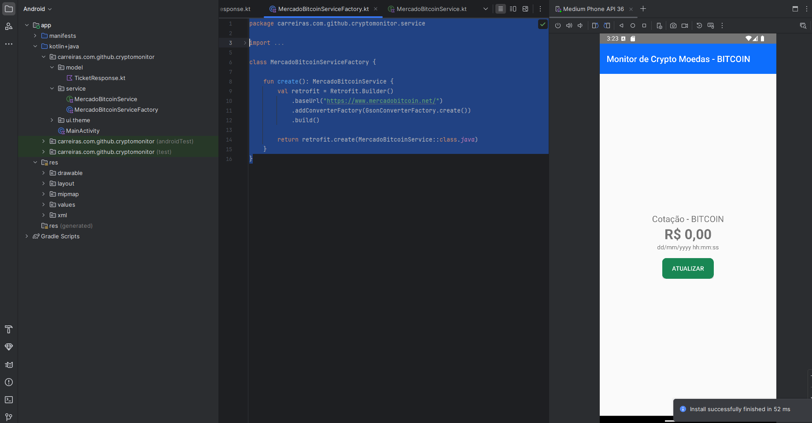
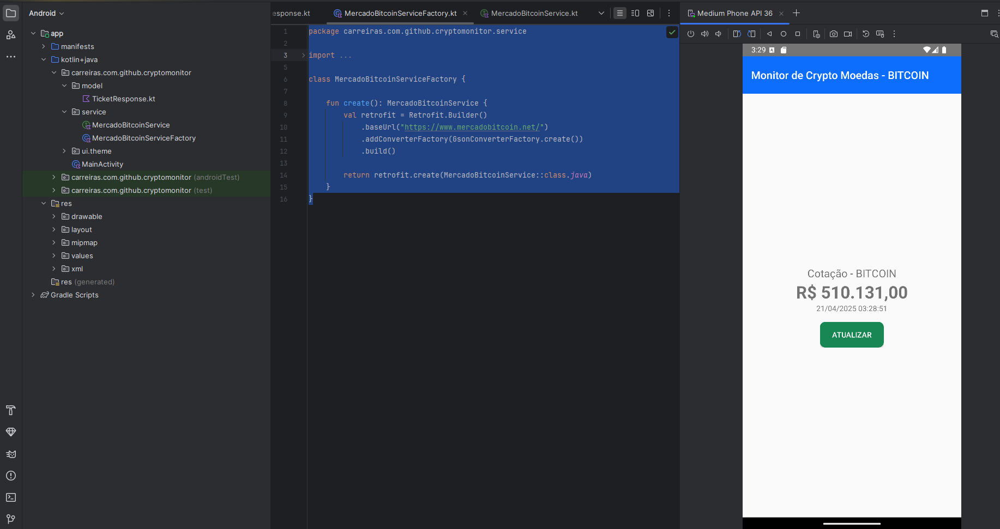

# 📱 Crypto Monitor - Android

Aplicação em Android criado com **Kotlin** para acompanhar o preço do **Bitcoin**, utilizando requisições HTTP com **Retrofit** e **corrotinas**.

---

## 📁 Estrutura de arquivos do projeto

### 🟢 `MainActivity.kt` (`main`)
Classe principal da aplicação, seu ponto de partida
Responsável por:
- Montar a interface da tela inicial  
- Personalizar a Toolbar  
- Controlar o botão **“ATUALIZAR”**  
- Executar a função `makeRestCall()` com uso de **corrotinas**

---

### 🧾 `MercadoBitcoinService.kt` (`service`)
Interface responsável por definir os endpoints da API pública do **Mercado Bitcoin**, usando Retrofit.

```kotlin
@GET("api/BTC/ticker/")
suspend fun getTicker(): Response<TickerResponse>
```

---

### 🛠 `MercadoBitcoinServiceFactory.kt` (`service`)
Classe que faz a instancia e configuração para a autilização de Rtrofit no aplicação 
Define:
- A base URL: `https://www.mercadobitcoin.net/`  
- O conversor JSON (GsonConverter)

---

### 🟣 `TickerResponse.kt` (`model`)
Modelo de dados que representa a estrutura da resposta da API.  
Permite que se visulize:
- Último valor do bitcoin (`last`)
- Data da cotação (`date`)
- Outros valores como: `high`, `low`, `vol`, `buy`, `sell`

---

## ▶️ Como executar o projeto

1. Abra o projeto no **Android Studio**
2. Utilize um emulador (recomendado: API 30+) ou conecte um dispositivo físico
3. Rode o projeto
4. O app será instalado e exibirá a moeda Bitcoin
5. Pressione **“ATUALIZAR”** para buscar os valores mais recentes

---

## ⚙️ Funcionamento do aplicativo

### 1. Inicialização
- Ao abrir o app, a `MainActivity` é iniciada
- A toolbar é configurada com título e cor personalizada
- O botão de atualização é ativado

### 2. Interação do usuário
- Ao tocar no botão, a função `makeRestCall()` é disparada
- A chamada HTTP ocorre sem bloquear a interface do usuário, graças ao uso de `Dispatchers.Main`

### 3. Requisição HTTP
- A chamada é feita para o endpoint `api/BTC/ticker/`
- O Retrofit é configurado dinamicamente via `MercadoBitcoinServiceFactory`

### 4. Apresentação dos dados
- O valor do Bitcoin é exibido em formato monetário BRL (R$), com `NumberFormat`
- A data da cotação é convertida de Unix timestamp para `"dd/MM/yyyy HH:mm:ss"`
- Os dados são exibidos nos componentes `TextView` da interface

### 5. Tratamento de erros
- Em caso de erro HTTP (400, 404 etc), uma mensagem Toast específica é mostrada
- Para falhas inesperadas (sem rede, erro de parsing etc), o app exibe uma mensagem genérica

---

## 📸 Exemplos no emulador android

### Tela inicial



### Após atualização da cotação



---

## 📌 Tecnologias utilizadas

- Kotlin
- Retrofit
- Coroutines
- AndroidX

---

